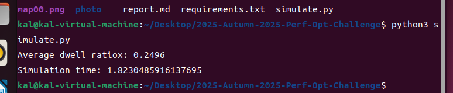

# 实验报告

作者： 李咏嘉

## 实验过程：

1. 配置环境：
   下载 Ubuntu 22.04 iso 和 VMware
   设置 NAT，打开终端 用 ping baidu.com 命令，检验网络连接成功
   
   下载 python3，VSC，gitbash 后 git 克隆题目
   创建 python3 venv 虚拟环境并激活
   

2. 初步实现了实验需求的初步功能，完成了框架搭建，检验模拟时间的正常运行，以及 Average dwell ratiox 的准确
   

3. 修改了部分代码，引入 numpy 库。并保留 baseline 版本，方便进行对比
   

4. 修正了原有程序的问题，完成了 dwellRatiox 的计算
   

5. 简单实现了最终数据分散的可视化
   

6. 分析两个版本的模拟时间的差异（详细对比在优化分析）

7. 更进一步优化了可视化表现
   

8. 优化算法：内存节省——将 int64 改为 int32 节省内存空间；方向生成加速——先预先生成方向矩阵，在这之后在用检索来引入加速实现；减少求和的计算占用——通过 .sum 直接求和减少；周期性边界优化——用加减运算代替取模提高运行速度（详细解释在优化分析）

9. 采集每个版本的数据，并进行数据对比，直观表现出计算优化的效果，进行问题复盘

## 算法说明：

### baseline 版本:

#### 核心代码：

     #生成粒子的坐标
     x = [random.randint(0,L-1) for _ in range(N)]
     y = [random.randint(0,L-1) for _ in range(N)]

     moveDirections = [(0,1),(0,-1),(1,0),(-1,0)]

给所有的粒子生成初始坐标,生成粒子方向

    for _ in range(T):
        for i in range(N):
            dx, dy = random.choice(moveDirections)
            x[i] += dx
            y[i] += dy
            #周期性边界条件（即从右边界走出 = 从左边界进入）
            x[i] %= L
            y[i] %= L
        totalCenterTCount = 0
        for i in range(N):
            #判断粒子是否在中心区域
            if (centerMin <= x[i] < centerMax) and (centerMin <= y[i] < centerMax):
            totalCenterTCount += 1
            totalCenterT += totalCenterTCount

对于每一步 T，历遍所有的粒子 N，并给它随机一个方向。统计每一步 T 所有在中心区域的粒子，之后统计所有在中心区域的粒子

### 导入 numpy 库版本

#### 核心代码:

    #生成粒子的坐标
    x = np.random.randint(0, L, N,dtype=np.int64)
    y = np.random.randint(0, L, N,dtype=np.int64)

一次生成 N 个整数的粒子坐标

    moveDirections = np.array([[0, 1], [0, -1], [1, 0], [-1, 0]], dtype=np.int64)

给出粒子移动方向的向量

    for t in range(T):
        selectDirections = np.random.randint(0,4,N,dtype=np.int64)
        dx,dy = moveDirections[selectDirections].T
        x += dx
        y += dy
        #周期性边界条件（即从右边界走出 = 从左边界进入）
        x = x  % L
        y = y  % L
        #判断粒子是否在中心区域
        centerT = (x >= centerMin) & (x < centerMax) & (y >= centerMin) & (y < centerMax)
        totalCenterT += sum(centerT)
        totalT = N * TdwellRatiox = totalCenterT/totalT

给所有的 N 粒子，进行随机移动方向的赋予，并计算每一步时所有在中心区域的粒子，进行 T 遍

## 优化分析：

### baseline 与 numpy 版本对比

#### 1. 引入库的对比

    numpy 的向量化运算和底层的 C 语言的实现的数据批量化操做让其相比于 Python 原有的数据循环的有了质的飞跃

#### 2. 功能模块分析：

    随机数生成：[python]random.randint   [numpy]np.random.randint   numpy的生成基于高效算法，速度更快
    求和计算：[python]for循环累加计数	[numpy]sum(centerT)（C 实现的求和函数）    Numpy 的sum函数避免了 Python 循环的

### 可视化的引入:

    resultMap,_,_ = np.histogram2d(x,y,bins=L,range=[[0,L],[0,L]])
    # result
    plt.figure(figsize=(10,10))
    plt.imshow(resultMap,cmap='viridis')
    plt.xlabel('x')
    plt.ylabel('y')
    plt.savefig('map.png')

在 L* L 的二维图中分出 L*L 的方格，即让所有的粒子都可以被统计到。在统计到之后，采用常用的 viridis 配色方案来显示粒子的位置与密度。之后定义了 X 与 Y 轴，并将生成的热力图保存在 map.jpg 图像中。

### 可视化优化：

    plt.imshow(resultMap, cmap='viridis', extent=[0, L, 0, L], origin='lower')  # 使y轴从下到上递增显示更合理
    plt.colorbar(label='Reference') #增加颜色条 使显示更直观

这样使生成的分布图更加直观,能够体现出每个网格的粒子密度

### 计算优化 V1;

#### 内存节省：

    x = np.random.randint(0, L, N,dtype=np.int32)
    y = np.random.randint(0, L, N,dtype=np.int32)

将原有的 int64 改成 int32 减少了不必的内存占用

    selectDirections = np.random.randint(0,4,N,dtype=np.int64)
    dx,dy = moveDirections[selectDirections].T

#### 方向生成加速：

    selectDirections = np.random.randint(0,4,N); dx, dy = moveDirections[selectDirections].T

将原有的重复性多直接花式索引改为 np.take 更该之后有着更快的响应速度

    dx, dy = np.take(moveDirections, np.random.randint(0,4,N), axis=0).T

#### 减少求和的计算占用：

    centerT = (x >= centerMin) & (x < centerMax) & (y >= centerMin) & (y < centerMax)
    totalCenterT += sum(centerT)

原有问题：先是创建了一个临时的布尔来判定是否位于中心区域之后再次进行计算，这会带来非必要的计算开销。在如下更改后直接计算，不创建临时的布尔数组来判定，减少了内存占用

    count = ((x >= centerMin) & (x < centerMax) & (y >= centerMin) & (y < centerMax)).sum()
    totalCenterT += count

#### 周期性边界优化：

    x = x % L
    y = y % L

原有的取模虽然实现了周期性边界但是计算速度仍然不理想，所以采用加减了加速处理

    x = np.where(x < 0, x + L, np.where(x >= L, x - L, x))
    y = np.where(y < 0, y + L, np.where(y >= L, y - L, y))

#### 累加时减少临时变量：

    count = (...)sum(); totalCenterT += count

原代码会创建一个临时变量产生额外的开销因此改为直接累加

    totalCenterT += ((x >= centerMin) & (x < centerMax)
    & (y >= centerMin) & (y < centerMax)).sum()

### 效果对比：

###### 数据来源：

(这里简单给出来源，选取每个版本的代表性，多余的重复已经省略)

上图中，数据上面为 baseline 版本 下面为还没有优化的 numpy 版本

此图为 numpy 版本优化后的数据

## 问题归纳：

1. python 运行时要采用虚拟环境：
   解决:用 python 自带 venv 虚拟环境来运行

2. 架构计算框架：
   解决：分为三个部分，先是生成出每一个粒子的坐标，二是赋予它们随机方向，三是执行 T 步

3. 发现模拟时间过长
   解决：循环遍历 N 个粒子，逐个判断是否在中心区域。采用 numpy 库，来实现一次生成所有粒子，降低运行时间,提高运行速度

4. 计算 dwellRatiox 出现了 0 的情况：
   解决：原有程序设计错误，原有的直接更改覆盖了坐标，更改之后实现了累加移动

5. 如何实现可视化并优化显示：
   解决：导入 matplotlib.pyplot 包（网上搜索+AI 帮助）学习了常用的绘图方法 采用常用的 cmap='viridis 配色，并引入了参考条，方便查看效果

6. 如何实现更进一步的计算优化:
   解决：看到了 numpy 这个用 C 语言写成的高速计算库，于是便萌生了这一个想法。引入它，是为了将原本一个一个实现的粒子生成等步骤，改为了直接生成，减少了计算开支，并且实现了向量化运算。我也在这个过程中学习到了计算优化的知识与魅力，把原本漫长的模拟时间缩小了几十倍，不得不说这是一个很有成就感的事情
